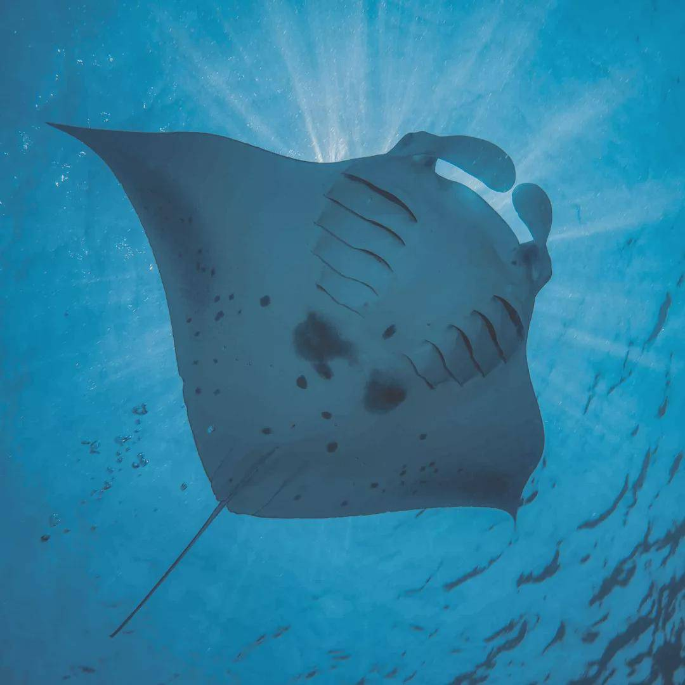

# Manta Ray（翼鳐）



翼鳐拥有宽大而独特的蝠翼状胸鳍，它们与身体相连并延伸到头部的两侧；翼鳐是世界上最大的鳐鱼，通常体长可达4-7米，翼展则可达到7-9米；翼鳐是远洋性的生物，经常出现在热带和亚热带的海洋中。它们以浮游生物为食，常常以慢速巡游的方式觅食。翼鳐是胎生的，雌性翼鳐每次可产下2-10只幼鱼，幼鱼在出生时就已经具备了独立生活的能力。

## 项目介绍

Manta Ray 是一个基于 Spring Cloud 的种子项目，用于快速构建中小型 API、RESTful API 项目，该项目已经集成了最常用的框架。

## 计划列表

- [ ] 服务网关 Spring Cloud Gateway
- [ ] 服务注册与发现 nacos
- [ ] 配置中心 nacos
- [ ] 服务监控
- [ ] 服务调用链监控 Spring Cloud Sleuth
- [ ] 服务熔断
- [ ] 服务降级
- [ ] 服务限流
- [ ] 服务安全 Spring Security
- [ ] 服务鉴权 Spring OAuth2
- [ ] 服务日志 Spring Cloud Sleuth
- [ ] 分布式事务 Seata
- [ ] 消息队列 Kafka
- [ ] 分布式调度任务 PowerJob
- [ ] 分布式缓存 Redis

```text
k8s
prometheus
grafana
ELK
istio
skywalking
kaili
minio
ceph
swagger
websocket
bpmn
activiti
antd
vue
react
qiankun
element-plus
ribbon
hystrix
```


